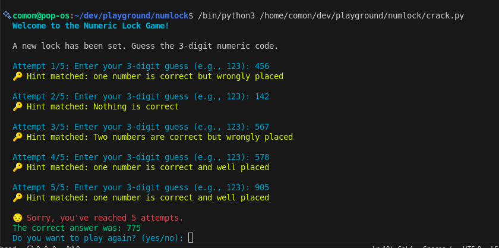

# Numeric Lock Puzzle Game

A fun terminal-based numeric lock puzzle game where players try to guess a randomly generated 3-digit numeric code based on a set of hints. The game is dynamic, provides feedback on each guess, and cycles to a new puzzle after every correct guess or after five incorrect attempts.



## Features
- Randomly generated 3-digit lock codes.
- Players receive feedback after each guess based on predefined hints.
- Up to 5 attempts per round.
- Game cycles to a new puzzle after each round.
- Colorful terminal output for enhanced player experience (requires `colorama`).
  
## Getting Started

### Prerequisites
Make sure you have Python 3 installed. You can check by running:
```bash
python --version 
```

## Contributing
Contributions are welcome! Follow the steps below to contribute to this project:

### Fork the Repository
Click the "Fork" button at the top right corner of this repository to create a copy under your GitHub account.

### Clone the Forked Repository
Clone your fork locally by running:

```bash
git clone https://github.com/your-username/numlock.git
```

### Create a Branch
Create a new branch where you can work on your changes:
```bash
git checkout -b your-feature-branch
```

### Make Changes
Work on your desired changes, whether it's adding a new feature, fixing a bug, or improving the codebase.

### Add Tests (if applicable)
If you're introducing a new feature, please consider adding unit tests to ensure the feature works as expected. You can use Python's unittest module or pytest.

### Commit and Push
Once your changes are ready, commit them and push to your fork:
```bash
git add .
git commit -m "Description of your changes"
git push origin your-feature-branch
```

### Create a Pull Request
Navigate to your fork on GitHub, and click the "Compare & pull request" button. Write a clear description of your changes and submit the PR.

### Respond to Feedback
Once you submit your PR, other contributors may review it and provide feedback. Please be responsive and make any necessary adjustments.


## Contribution Guidelines
Write clear commit messages: Your commit messages should explain what and why changes were made.
Follow the project's coding style: Keep the codebase consistent by adhering to the established coding conventions (e.g., PEP8 for Python).
Test your changes: Ensure your changes work correctly by testing them locally before creating a pull request.
Small, focused PRs: Try to limit pull requests to a single feature or issue. This makes the review process smoother.

### Issue Reporting
If you encounter any bugs or have feature requests, please open an issue. Make sure to include a detailed description and steps to reproduce (if applicable).

### License
This project is licensed under the GNU GENERAL PUBLIC LICENSE - see the LICENSE file for details.

### Acknowledgements
Thanks to all contributors and open-source libraries, especially colorama for making terminal colors easy to implement!


### Key Sections:
- **Getting Started**: Basic instructions for users to run the project.
- **Contributing**: Detailed steps for forking the project, creating a branch, making changes, and submitting a pull request.
- **Contribution Guidelines**: Suggestions to help contributors stay in line with the project’s coding practices.
- **Issue Reporting**: Encourages contributors to report issues or request features via GitHub Issues.

This template ensures that your project is easy to understand and contribute to, making the onboarding process smoother for new contributors. Make sure to replace `"your-username"` with your actual GitHub username.
